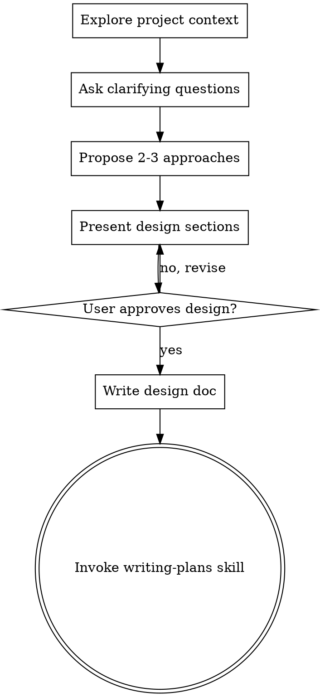

# Brainstorming Ideas Into Designs

## Overview

Help turn ideas into fully formed designs and specs through natural collaborative dialogue.

Start by understanding the current project context, then ask questions one at a time to refine the idea. Once you understand what you're building, present the design and get user approval.

## Why Design-First?

Presenting a design before implementation prevents several costly failure modes:
- **Misaligned assumptions** — Coding toward the wrong goal is expensive to unwind
- **Scope creep** — Design clarifies boundaries; implementation without it invites feature bloat
- **Architecture rework** — Early code often creates structural debt that compounds
- **Wasted specialization** — Implementation skills are powerful but wasteful without clear direction

This applies to every project, including simple ones. A todo list, single-function utility, or config change can all ship the wrong thing. The design can be concise for simple projects (a few sentences), but it should exist and be approved before implementation begins.

## Anti-Pattern: "This Is Too Simple To Need A Design"

See Common Pitfall 1 below for the detailed failure mode and prevention steps.

## Workflow

Work through these phases systematically. Each step builds on the previous one:

1. **Explore project context** — check files, docs, recent commits to ground the conversation in reality
2. **Ask clarifying questions** — one at a time, understand purpose/constraints/success criteria
3. **Propose 2-3 approaches** — with trade-offs and your recommendation to show you've considered alternatives
4. **Present design** — in sections scaled to their complexity, get user approval after each section
5. **Write design doc** — save to `docs/plans/YYYY-MM-DD-<topic>-design.md` and commit to preserve decisions
6. **Transition to implementation** — invoke writing-plans skill to create the detailed implementation plan

## Process Flow

**The next step is invoking writing-plans** to move from design to detailed planning. Other implementation skills (frontend-design, mcp-builder, etc.) come after the plan is written. This sequencing ensures the implementation plan itself has been validated and can guide the work effectively.

## The Process

**Understanding the idea:**
- Check out the current project state first (files, docs, recent commits)
- Ask questions one at a time to refine the idea
- Prefer multiple choice questions when possible, but open-ended is fine too
- Only one question per message - if a topic needs more exploration, break it into multiple questions
- Focus on understanding: purpose, constraints, success criteria

**Exploring approaches:**
- Propose 2-3 different approaches with trade-offs
- Present options conversationally with your recommendation and reasoning
- Lead with your recommended option and explain why

**Presenting the design:**
- Once you believe you understand what you're building, present the design
- Scale each section to its complexity: a few sentences if straightforward, up to 200-300 words if nuanced
- Ask after each section whether it looks right so far
- Cover: architecture, components, data flow, error handling, testing
- Be ready to go back and clarify if something doesn't make sense

## After the Design

**Documentation:**
- Write the validated design to `docs/plans/YYYY-MM-DD-<topic>-design.md`
- Use elements-of-style:writing-clearly-and-concisely skill if available
- Commit the design document to git

**Implementation:**
- Invoke the writing-plans skill to create a detailed implementation plan
- Do NOT invoke any other skill. writing-plans is the next step.

## Key Principles

- **One question at a time** - Don't overwhelm with multiple questions
- **Multiple choice preferred** - Easier to answer than open-ended when possible
- **YAGNI ruthlessly** - Remove unnecessary features from all designs
- **Explore alternatives** - Always propose 2-3 approaches before settling
- **Incremental validation** - Present design, get approval before moving on
- **Be flexible** - Go back and clarify when something doesn't make sense

## Examples

### Example 1: New Feature Request

**User:** "Let's add dark mode to the app"

**Brainstorming workflow:**
1. Check current theme implementation
2. Ask: "Should dark mode be automatic (system preference), manual toggle, or both?"
3. Propose 3 approaches: CSS variables, Tailwind dark: classes, or theme provider
4. Present design sections: color palette, component updates, storage strategy
5. Get approval on each section
6. Write design doc to `docs/plans/YYYY-MM-DD-dark-mode-design.md`
7. Invoke writing-plans skill

**Expected output:** Validated design document + transition to planning

### Example 2: Utility Function

**User:** "I need a function to format phone numbers"

**Brainstorming workflow:**
1. Ask: "What formats should it support? (US only, international, etc.)"
2. Ask: "Should it validate or just format?"
3. Propose approaches: regex-based, library (libphonenumber), or simple formatter
4. Present design: function signature, edge cases, error handling
5. Get approval
6. Write brief design doc
7. Invoke writing-plans

**Expected output:** Even "simple" utilities get a design first

### Example 3: Architectural Change

**User:** "We should migrate from REST to GraphQL"

**Brainstorming workflow:**
1. Review current API structure and client usage
2. Ask: "What's driving this? Performance, developer experience, or specific features?"
3. Ask: "Is this a gradual migration or big-bang?"
4. Propose 3 approaches: parallel APIs, GraphQL wrapper over REST, full rewrite
5. Present design: schema design, migration strategy, backward compatibility
6. Iteratively present sections, getting approval
7. Write comprehensive design doc
8. Invoke writing-plans

**Expected output:** Multi-phase design with migration strategy

## Troubleshooting

### Issue: User Keeps Asking "Just Build It"

**Symptoms:** User wants to skip brainstorming and go straight to code

**Cause:** Perceives design phase as overhead for "simple" tasks

**Solution:**
1. Acknowledge the urgency: "I understand you want to move fast"
2. Explain the risk: "Without design, we might build the wrong thing"  
3. Propose time-boxed design: "Let me ask 2 quick questions to confirm the approach"
4. If user still insists, present a minimal design: "Here's what I'm planning to build..."
5. Get explicit approval before proceeding

### Issue: Design Becomes Implementation Plan

**Symptoms:** Design document includes code snippets, file structures, or step-by-step instructions

**Cause:** Confusing design (what/why) with planning (how/when)

**Solution:**
1. Keep design focused on: architecture, components, data flow, trade-offs
2. Defer implementation details to writing-plans skill
3. If you catch yourself writing "Step 1: Create file X", stop and move to planning phase

### Issue: User Changes Mind Mid-Implementation

**Symptoms:** After starting work, user requests different behavior or approach

**Cause:** Design wasn't concrete enough or assumptions weren't validated

**Solution:**
1. Stop implementation immediately
2. Return to brainstorming mode
3. Ask clarifying questions about the new requirements
4. Present revised design
5. Get explicit approval before resuming implementation
6. Update design doc with new decisions

### Issue: Stuck in Endless Design Iteration

**Symptoms:** User keeps asking for more options or isn't satisfied with any design

**Cause:** Unclear success criteria or user isn't sure what they want

**Solution:**
1. Step back and ask: "What would the ideal outcome look like?"
2. Propose a minimal viable version: "What's the smallest thing we could build that would be useful?"
3. Suggest prototyping: "Should we build a quick prototype to explore this?"
4. If still stuck, propose time-boxing: "Let's go with Option A and revisit if it doesn't work"

## Common Pitfalls

### 1. Skipping Brainstorming for "Simple" Tasks

**What happens:** You recognize a task as straightforward (single component, small utility, config change) and proceed directly to implementation, planning to sort out details while coding.

**Why it backfires:** "Simple" tasks are where assumptions are most dangerous because they feel obvious. You code one behavior, the user expected another, and by the time you learn this the scaffolding is already in place and needs rework.

**How to avoid it:** Treat simplicity as a reason to make brainstorming *faster*, not to skip it. A 30-second conversation ("This is a single-file utility that does X, right?") prevents a 30-minute refactor. Even explicit agreement on what seems obvious is valuable.

### 2. Proceeding to Code Before Explicit User Approval

**What happens:** You present a design, the user asks a clarifying question, and you interpret that as mild interest and start writing code while "thinking about their feedback."

**Why it backfires:** The user is still evaluating. Code written before approval is often code that needs rewriting. You've signaled that you're moving forward when the design isn't locked down.

**How to avoid it:** Wait for explicit approval language ("Looks good," "Let's go with that," "Ship it") before invoking writing-plans. A single clarifying question means the design isn't final — revise and re-present.

### 3. Invoking Implementation Skills Directly Instead of Writing Plans

**What happens:** After design approval, you're tempted to jump straight to frontend-design, mcp-builder, or another implementation skill rather than invoke writing-plans first.

**Why it backfires:** Implementation skills are powerful but unstructured. They work best when given a detailed plan that specifies scope, acceptance criteria, and technical decisions. Skipping the plan means the skill has to reinvent it, leading to inefficient work and potential scope creep.

**How to avoid it:** Always invoke writing-plans as the bridge between brainstorming and implementation. Let it formalize the decisions from brainstorming into a concrete plan that implementation skills can follow.

### 4. Designs That Are Too Abstract to Implement

**What happens:** You present a design that's philosophically sound but lacks concrete details — "We'll have a responsive grid that shows items" without saying how many columns, what breakpoints, or how filtering works.

**Why it backfires:** Implementation starts with questions because the design doesn't answer them. You end up in a loop where the implementer has to guess at details, implement them wrong, and you have to revise.

**How to avoid it:** Make designs concrete enough that an implementer can start work without opening the design doc and asking questions. Include examples, specific numbers, edge cases, and trade-off decisions. If a detail feels unclear to you, it'll be unclear during implementation.
